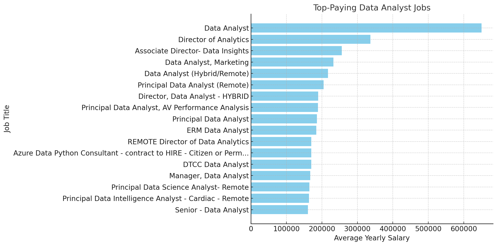
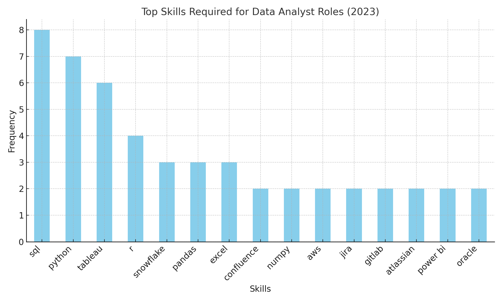

Finish your readme file on GitHub. You can include:

# Introduction 
This project focuses on uncovering the most lucrative roles in data analytics as a Data Analyst and Data Engineer, 
analyzing the skills in highest demand, and identifying where these two factors 
intersect,high-demand jobs with high salaries.

Our key objectives include:

- **Identifying Top-Paying Roles:** Analyzing job postings to find positions with the highest average salaries in the data analytics domain.

- **Highlighting In-Demand Skills:** Pinpointing the technical and soft skills most frequently required by employers.

- **Mapping the Demand-Salary Intersection:** Identifying jobs that are both in high demand and offer competitive salaries, providing insights into the most strategic career paths.

Check out my SQL queries here: [project_sql folder](/project_sql/).

# Background 
The growing significance of data in driving business decisions has made 
data-centric roles, such as data analysts and data engineers, pivotal in the modern workforce.
As someone keen on exploring these fields, my motivation to understand the job 
market for these roles stems from three core aspirations:

- 1.***Aligning Skills with Market Demand:***

The roles of data analysts and data engineers require a dynamic skillset that 
evolves with technology and industry needs. By analyzing the job market, 
I can identify the most in-demand tools, technologies, and qualifications, 
allowing me to tailor my learning and career development to stay competitive 
and relevant.

- 2.***Navigating Career Opportunities***

With a clear understanding of which roles offer the highest salaries, 
career growth potential, and job security, I can make informed decisions about 
my career trajectory. This knowledge is crucial in identifying paths that 
align with my personal goals, interests, and the value I wish to bring to 
organizations.

- 3.***Contributing to Data-Driven Transformation***

Data professionals play a critical role in solving complex problems, 
optimizing processes, and enabling innovation. By understanding the nuances 
of these roles, I aim to position myself not only as a competent professional 
but also as someone who can drive impactful change in organizations and 
industries.


The data for this analysis is from Luke Barousse’s SQL Course (https://lukebarousse.com/sql). This data includes details on job titles, salaries, locations, and 
required skills. 

## The questions I wanted to answer through my SQL queries were:

1. What are the top-paying data analyst and data engineer jobs working from a remote area?
2. What skills are required for these top-paying jobs?
3. What skills are most in demand for data analysts and data engineers?
4. Which skills are associated with higher salaries for both roles?
5. What are the most optimal skills to learn for a data analyst and a data engineer looking to maximize job market value?


# Tools 

In this project, I utilized a variety of tools to conduct my analysis:

- **SQL:** (Structured Query Language): Enabled me to interact with the database, extract insights, and answer my key questions through queries.
- **PostgreSQL:** As the database management system, PostgreSQL allowed me to store, query, and manipulate the job posting data.
- **Visual Studio Code:** This open-source administration and development platform helped me manage the database and execute SQL queries.


# How You Used the Tools or Analysis - Explain how you used the tools (get into the details of each query/analysis).

Each query for this project aimed at investigating specific aspects of the data analyst job market. Here’s how I approached each question:

### 1a. Top Paying Data Analyst Jobs

To identify the highest-paying roles, I filtered data analyst positions by average yearly salary and location, focusing on remote jobs. This query highlights the high paying opportunities in the field.

```sql
SELECT
	job_id,
	job_title,
	job_location,
	job_schedule_type,
	salary_year_avg,
	job_posted_date,
    name as company_name

FROM
	job_postings_fact
LEFT JOIN company_dim ON job_postings_fact.company_id = company_dim.company_id
WHERE 
    job_title_short = 'Data Analyst'
    AND job_location = 'Anywhere'
    AND salary_year_avg IS NOT NULL
ORDER BY
    salary_year_avg DESC
LIMIT 20;
```


 


### 1a. Top Paying Data Engineer Jobs

This query highlights the high paying opportunities for the Data Engineer roles.
This time we only filtered the data by the average yearly salary.

```sql
SELECT
	job_id,
	job_title,
	job_location,
	job_schedule_type,
	salary_year_avg,
	job_posted_date,
    name as company_name

FROM
	job_postings_fact
LEFT JOIN company_dim ON job_postings_fact.company_id = company_dim.company_id
WHERE 
    job_title_short = 'Data Engineer'
    AND job_location IS NOT NULL
    AND salary_year_avg IS NOT NULL
ORDER BY
    salary_year_avg DESC
LIMIT 10;
```
# MISSING VISUAL
### 2. Data Analyst Skills for Top Paying Jobs

To understand what skills are required for the top-paying jobs, I joined the job postings with high salaries with the skills data, providing insights into what employers value for high-compensation roles.

```sql

WITH top_paying_jobs_for_Data_Analyst AS (

SELECT
	job_id,
	job_title,
	job_location,
	job_schedule_type,
	salary_year_avg,
	job_posted_date,
    name as company_name

FROM
	job_postings_fact
LEFT JOIN company_dim ON job_postings_fact.company_id = company_dim.company_id
WHERE 
    job_title_short = 'Data Analyst'
    AND job_location = 'Anywhere'
    AND salary_year_avg IS NOT NULL
ORDER BY
    salary_year_avg DESC
LIMIT 10

)

SELECT 
    top_paying_jobs_for_Data_Analyst.job_id,
    top_paying_jobs_for_Data_Analyst.company_name,
    top_paying_jobs_for_Data_Analyst.job_title,
    top_paying_jobs_for_Data_Analyst.salary_year_avg,
    skills_dim.skills
FROM top_paying_jobs_for_Data_Analyst
INNER JOIN
    skills_job_dim ON top_paying_jobs_for_Data_Analyst.job_id = skills_job_dim.job_id
INNER JOIN
    skills_dim ON skills_job_dim.skill_id = skills_dim.skill_id
ORDER BY
    top_paying_jobs_for_Data_Analyst.salary_year_avg DESC;
```




Here are the insights from the "skills" column:

Top skills required:

SQL (mentioned 8 times) is the most in-demand skill.
Python (7 mentions) follows as a key programming skill.
Tableau (6 mentions) is highly sought for data visualization.
Other frequently mentioned skills:

R (4 mentions), Snowflake, Pandas, and Excel (3 mentions each) are also popular.
Cloud platforms like Azure and AWS are increasingly prominent (2 mentions each).
Diverse tools:

Tools for collaboration and workflow, such as Jira, Confluence, and Bitbucket, have multiple mentions.
Specialized tools like Power BI, Databricks, and SAP also make appearances.


### 3a. In-Demand Skills for Data Analysts

This query helped identify the skills most frequently requested in job postings, by filtering the average yearly salary and directing the focus to areas with high demand.

```sql
SELECT
  skills_dim.skills,
  COUNT(skills_job_dim.job_id) AS demand_count
FROM
  job_postings_fact
  INNER JOIN
    skills_job_dim ON job_postings_fact.job_id = skills_job_dim.job_id
  INNER JOIN
    skills_dim ON skills_job_dim.skill_id = skills_dim.skill_id
WHERE
  -- Filters job titles for 'Data Analyst' roles
  job_postings_fact.job_title_short = 'Data Analyst'
  AND job_postings_fact.salary_year_avg > 70000
	-- AND job_work_from_home = True -- optional to filter for remote jobs
GROUP BY
  skills_dim.skills
ORDER BY
  demand_count DESC
LIMIT 5;
```
| skills  | demand_count |
| ------- | ------------ |
| sql     | 2455         |
| python  | 1532         |
| excel   | 1457         |
| tableau | 1349         |
| R       | 884          |


### 3b. In-Demand Skills for Data Engineers

This query helped identify the skills most frequently requested in job postings for Data Engineers, we filtered the data by the column work from home and the average yearly salaries. We show the areas with high demand.

```sql
SELECT
  skills_dim.skills,
  COUNT(skills_job_dim.job_id) AS demand_count
FROM
  job_postings_fact
  INNER JOIN
    skills_job_dim ON job_postings_fact.job_id = skills_job_dim.job_id
  INNER JOIN
    skills_dim ON skills_job_dim.skill_id = skills_dim.skill_id
WHERE
  -- Filters job titles for 'Data Analyst' roles
  job_postings_fact.job_title_short = 'Data Engineer' 
  AND job_postings_fact.job_work_from_home = TRUE
  AND job_postings_fact.salary_year_avg > 70000
	-- AND job_work_from_home = True -- optional to filter for remote jobs
GROUP BY
  skills_dim.skills
ORDER BY
  demand_count DESC
LIMIT 5;
```

| skills | demand_count |
| ------ | ------------ |
| sql    | 544          |
| python | 504          |
| aws    | 345          |
| azure  | 242          |
| spark  | 223          |


-- 


*Show the top paying roles*

# What You Learned - Specific techniques and skills you Learned

# Insights - The insights you got from each this analysis and what you would do with this information.


# Conclusion - Wrapping everything up.